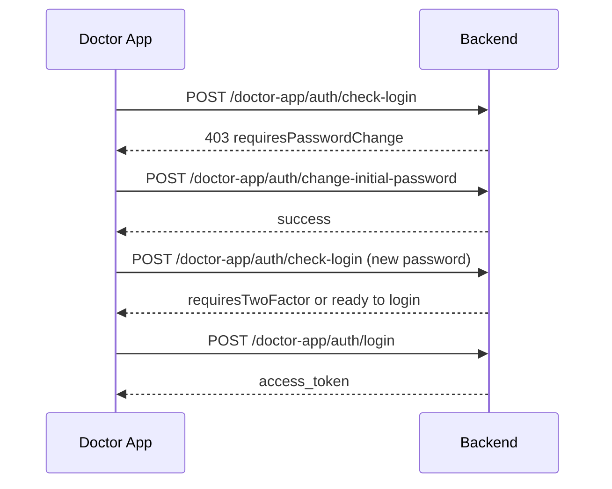
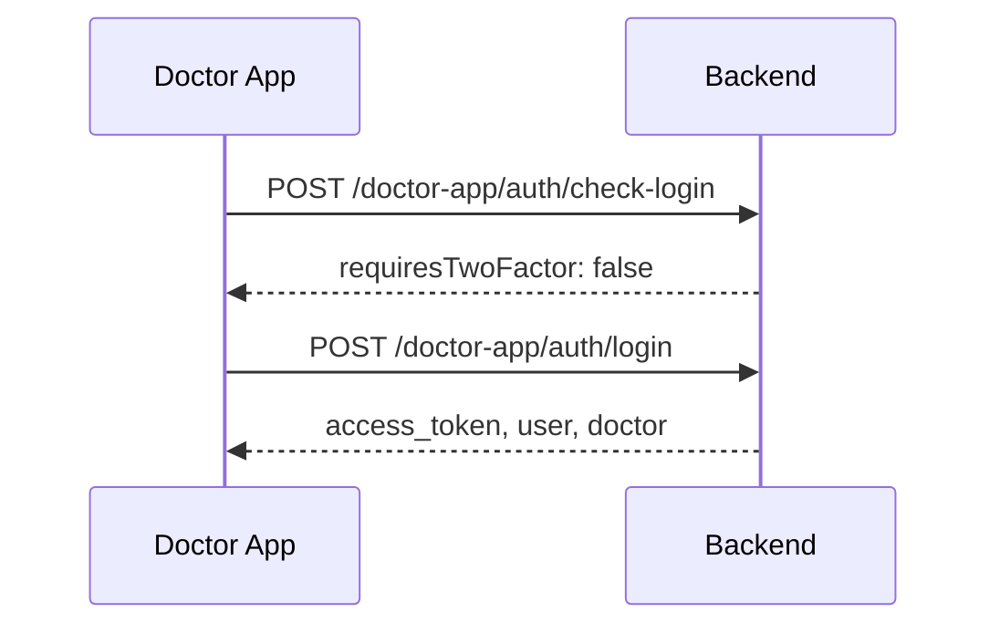
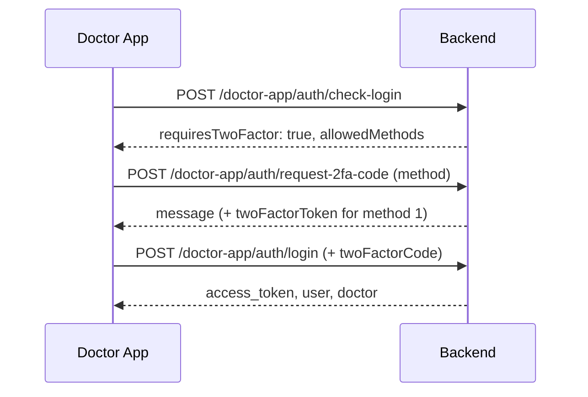

# Doctor Mobile App API

REST API for the doctor mobile app. Doctors log in as **Users** with `userType = 3` (Doctor), created in the admin **Users** module. Login accepts **email or username**; when two-factor authentication (2FA) applies, behavior matches the web dashboard (group policy + user preference).

After login, use the **doctor app Bearer token** for protected routes such as sessions. Do **not** use the public OAuth API client token (`/api/public/token`) in the mobile app.

**Base URL:** `http://localhost:3000` (replace for staging/production).

All endpoints use `Content-Type: application/json` unless noted otherwise.

---

## Overview

| Method | Path | Auth | Description |
|--------|------|------|-------------|
| `POST` | `/api/doctor-app/auth/check-login` | None | Validate credentials; learn if 2FA is required |
| `POST` | `/api/doctor-app/auth/change-initial-password` | None | First login: replace admin-set password |
| `POST` | `/api/doctor-app/auth/request-2fa-code` | None | Send or prepare 2FA code (after check-login) |
| `POST` | `/api/doctor-app/auth/login` | None | Complete login; returns Bearer JWT + profiles |
| `GET` | `/api/doctor-app/auth/me` | Bearer | Current user and linked doctor profile |
| `GET` | `/api/doctor-app/sessions` | Bearer | Sessions for the logged-in doctor (`fromDate` optional) with bookings |
| `GET` | `/api/doctor-app/sessions/:sessionId` | Bearer | One session by id for the logged-in doctor |
| `PATCH` | `/api/doctor-app/profile` | Bearer | Update doctor profile (only allowed fields) |
| `POST` | `/api/doctor-app/profile/change-password` | Bearer | Change doctor account password |

Routes live under `/api/` and are **not** protected by NextAuth session middleware (same pattern as `/api/auth/*`).

---

## Prerequisites (Admin Setup)

1. **Create a User** in the dashboard with **User Type = Doctor** (`userType: 3`).
2. Assign a **User Group** if you use group-level 2FA rules.
3. Set **email** and optionally **username** (doctors may log in with either).
4. For **SMS 2FA**, set the user **phone** (mobile) on the user record.
5. **Link to Doctor master data** (so `doctor` is returned after login):
   - **Recommended:** set the user **username** to the doctor’s **code** (e.g. `DR001`), or
   - Link an active **Account** record with both `userId` and `doctorId`.

Only **active** users (`status: 1`) with `userType: 3` can use these endpoints. Admin/staff accounts receive `401 Invalid credentials` even with a correct password.

---

## Login Identifier

Every auth POST body accepts the login id in **either** field (same value semantics):

| Field | Description |
|-------|-------------|
| `email` | User’s email **or** username |
| `username` | Same as `email` — use whichever fits the mobile UI |

`password` is always required.

---

## Two-Factor Authentication (2FA)

2FA rules are the same as the web app. See also [2FA_PROCEDURE.md](./2FA_PROCEDURE.md).

**2FA is required at login only when both are true:**

1. `user.twoFactorEnabled === true` (user/admin setting)
2. User group allows 2FA (`userGroup.twoFactorEnabled === true`, or user has no group)

**Method IDs** (`lib/helpers/2fa/constants.ts`):

| ID | Method | Notes |
|----|--------|--------|
| `1` | Authenticator (TOTP) | May return `twoFactorToken`, `uri`, `secret` on first setup |
| `2` | SMS | Requires `user.phone`; 6-digit code |
| `3` | Email | Backend currently returns unavailable (same as web) |

Allowed methods for a user come from `userGroup.twoFactorMethods`, or default `["1","2","3"]`.

**Expirations (env overrides):**

- Authenticator pending step: `TWO_FA_PENDING_EXPIRY_MINUTES` (default 10)
- SMS/email code: `TWO_FA_CODE_EXPIRY_MINUTES` (default 5)

---

## First Login – Password Change

When an admin creates a doctor user, `mustChangePassword` is set to `true`. **Login and 2FA are blocked** until the user sets a new password (same as the web dashboard).

Web equivalent: `POST /api/auth/change-initial-password`  
Doctor app: `POST /api/doctor-app/auth/change-initial-password` (doctor users only, `userType: 3`).

### Detecting the requirement

`check-login` or `login` returns **403**:

```json
{
  "requiresPasswordChange": true,
  "error": "Password change required"
}
```

### Flow

1. User enters email/username + **admin-given** password on check-login → `requiresPasswordChange: true`.
2. App shows “Set new password” screen.
3. `POST /api/doctor-app/auth/change-initial-password` with current + new password.
4. User signs in again with the **new** password (normal check-login → login / 2FA flow).

### Password rules

Same as the dashboard (`lib/validations/password.ts`):

- Minimum **8** characters
- At least one uppercase, lowercase, digit, and special character
- **No spaces**
- New password must differ from the current password

---

## Flow Diagrams

### First login (password change required)



### Login without 2FA



### Login with 2FA



---

## Access Token (JWT)

After successful `login`, use:

```http
Authorization: Bearer <access_token>
```

| Setting | Env variable | Default |
|---------|----------------|---------|
| Token lifetime (seconds) | `DOCTOR_APP_TOKEN_EXPIRES_SEC` | `604800` (7 days) |
| Signing secret | `DOCTOR_APP_JWT_SECRET` | Falls back to `OAUTH_JWT_SECRET`, `JWT_SECRET`, or `NEXTAUTH_SECRET` |

JWT claims: `sub` = user id, `userType` = `3`, issuer/audience `channeling-doctor-app`.

---

## 1. Check Login

**POST** `/api/doctor-app/auth/check-login`

Validates credentials and returns whether 2FA is required before calling `login`.

### Request body

```json
{
  "email": "dr@hospital.lk",
  "password": "YourPassword1!"
}
```

Or:

```json
{
  "username": "DR001",
  "password": "YourPassword1!"
}
```

### Success – no 2FA (200)

```json
{
  "success": true,
  "requiresTwoFactor": false
}
```

### Success – 2FA required (200)

```json
{
  "requiresTwoFactor": true,
  "allowedMethods": ["1", "2"]
}
```

### Errors

| Status | Body | Meaning |
|--------|------|---------|
| `400` | `{ "error": "Email/username and password required" }` | Missing fields |
| `401` | `{ "error": "Invalid credentials" }` | Wrong id/password or not a doctor user |
| `403` | `{ "requiresPasswordChange": true }` | Call **change-initial-password** before login |
| `500` | `{ "error": "Server error" }` | Unexpected failure |

### cURL

```bash
curl -X POST "http://localhost:3000/api/doctor-app/auth/check-login" \
  -H "Content-Type: application/json" \
  -d '{"username":"DR001","password":"YourPassword1!"}'
```

---

## 2. Change Initial Password (first login)

**POST** `/api/doctor-app/auth/change-initial-password`

Replaces the admin-set password when `mustChangePassword` is `true`. Only **doctor** users (`userType: 3`). After success, run **check-login** and **login** with the **new** password.

### Request body

```json
{
  "email": "dr@hospital.lk",
  "currentPassword": "TempPassFromAdmin1!",
  "newPassword": "MyNewSecure1!",
  "confirmPassword": "MyNewSecure1!"
}
```

| Field | Required | Description |
|-------|----------|-------------|
| `email` or `username` | Yes | Login identifier |
| `currentPassword` | Yes | Password given by admin |
| `newPassword` | Yes | New password (see [rules](#first-login--password-change)) |
| `confirmPassword` | No | If sent, must match `newPassword` |

### Success (200)

```json
{
  "success": true,
  "message": "Password updated. Sign in again with your email/username and new password."
}
```

### Errors

| Status | Body | Meaning |
|--------|------|---------|
| `400` | Validation / no change required / wrong current password | See `error` message |
| `401` | Invalid credentials | Not a doctor user or wrong identifier |
| `500` | Server error | — |

### cURL

```bash
curl -X POST "http://localhost:3000/api/doctor-app/auth/change-initial-password" \
  -H "Content-Type: application/json" \
  -d '{
    "username": "DR001",
    "currentPassword": "TempPassFromAdmin1!",
    "newPassword": "MyNewSecure1!",
    "confirmPassword": "MyNewSecure1!"
  }'
```

---

## 3. Request 2FA Code

**POST** `/api/doctor-app/auth/request-2fa-code`

Call after `check-login` returns `requiresTwoFactor: true`. User picks a method from `allowedMethods`.

### Request body

```json
{
  "email": "dr@hospital.lk",
  "password": "YourPassword1!",
  "method": "2"
}
```

| Field | Required | Description |
|-------|----------|-------------|
| `email` or `username` | Yes | Login identifier |
| `password` | Yes | Same password as check-login |
| `method` | Yes | `"1"`, `"2"`, or `"3"` |

### Success – SMS (200)

```json
{
  "message": "A verification code has been sent to your phone"
}
```

### Success – Authenticator, existing secret (200)

```json
{
  "twoFactorToken": "a1b2c3...hex...",
  "message": "Enter the 6-digit code from your authenticator app"
}
```

### Success – Authenticator, first-time setup (200)

```json
{
  "twoFactorToken": "a1b2c3...hex...",
  "needsSetup": true,
  "uri": "otpauth://totp/...",
  "secret": "BASE32SECRET",
  "message": "Set up your authenticator app, then enter the 6-digit code to complete login"
}
```

Pass `twoFactorToken` into the `login` request when verifying method `1`.

### Errors

| Status | Body | Meaning |
|--------|------|---------|
| `400` | Missing fields / phone not set | Bad request |
| `401` | Invalid credentials | — |
| `403` | 2FA not enabled / method not allowed / group disabled | — |
| `503` | SMS/email send failed | Retry or another method |

### cURL (SMS)

```bash
curl -X POST "http://localhost:3000/api/doctor-app/auth/request-2fa-code" \
  -H "Content-Type: application/json" \
  -d '{"email":"dr@hospital.lk","password":"YourPassword1!","method":"2"}'
```

---

## 4. Login

**POST** `/api/doctor-app/auth/login`

Completes authentication and returns a Bearer token plus user and doctor summaries.

### Request body – no 2FA

```json
{
  "username": "DR001",
  "password": "YourPassword1!"
}
```

### Request body – with 2FA (SMS)

```json
{
  "email": "dr@hospital.lk",
  "password": "YourPassword1!",
  "twoFactorCode": "123456"
}
```

### Request body – with 2FA (Authenticator)

```json
{
  "email": "dr@hospital.lk",
  "password": "YourPassword1!",
  "twoFactorCode": "123456",
  "twoFactorToken": "hex-from-request-2fa-code"
}
```

| Field | Required | Description |
|-------|----------|-------------|
| `email` or `username` | Yes | Login identifier |
| `password` | Yes | Password |
| `twoFactorCode` | When 2FA required | 6-digit TOTP or SMS code |
| `twoFactorToken` | Authenticator only | From `request-2fa-code` when `method` was `"1"` |

### Success (200)

```json
{
  "access_token": "eyJhbGciOiJIUzI1NiIs...",
  "token_type": "Bearer",
  "expires_in": 604800,
  "user": {
    "id": "665f...",
    "name": "Dr. Silva",
    "email": "dr@hospital.lk",
    "username": "DR001",
    "phone": "0771234567",
    "userType": 3
  },
  "doctor": {
    "id": "665a...",
    "title": "Dr.",
    "name": "Silva",
    "code": "DR001",
    "mobile": "0771234567",
    "phone": null,
    "qualification": "MBBS",
    "registrationNumber": "12345",
    "speciality": {
      "id": "664b...",
      "name": "Cardiology",
      "code": "CARD"
    }
  }
}
```

`doctor` may be `null` if no linked Doctor record was found (see [Prerequisites](#prerequisites-admin-setup)).

### Errors

| Status | Body | Meaning |
|--------|------|---------|
| `400` | Missing fields / 2FA not enabled but code sent | Bad request |
| `401` | Invalid credentials / invalid or expired 2FA code | — |
| `403` | `requiresTwoFactor: true` (call without code) / password change required | — |
| `500` | Server error | — |

If login is called without `twoFactorCode` when 2FA is required:

```json
{
  "requiresTwoFactor": true,
  "allowedMethods": ["1", "2"],
  "error": "Two-factor authentication required"
}
```

### cURL

```bash
curl -X POST "http://localhost:3000/api/doctor-app/auth/login" \
  -H "Content-Type: application/json" \
  -d '{"username":"DR001","password":"YourPassword1!"}'
```

---

## 5. Current Session (Me)

**GET** `/api/doctor-app/auth/me`

Returns the authenticated doctor user and linked doctor profile.

### Headers

```http
Authorization: Bearer <access_token>
```

### Success (200)

```json
{
  "user": {
    "id": "665f...",
    "name": "Dr. Silva",
    "email": "dr@hospital.lk",
    "username": "DR001",
    "phone": "0771234567",
    "userType": 3
  },
  "doctor": {
    "id": "665a...",
    "title": "Dr.",
    "name": "Silva",
    "code": "DR001",
    "mobile": "0771234567",
    "phone": null,
    "qualification": "MBBS",
    "registrationNumber": "12345",
    "speciality": null
  }
}
```

### Errors

| Status | Body | Meaning |
|--------|------|---------|
| `401` | `{ "error": "Unauthorized" }` | Missing, invalid, or expired token |
| `500` | `{ "error": "Server error" }` | — |

### cURL

```bash
curl -X GET "http://localhost:3000/api/doctor-app/auth/me" \
  -H "Authorization: Bearer YOUR_ACCESS_TOKEN"
```

---

## 6. Sessions

**GET** `/api/doctor-app/sessions?fromDate=YYYY-MM-DD`

Returns channel sessions for the **logged-in doctor**. The doctor is resolved from the user’s linked Account or `username` = doctor code (same rules as [Doctor Profile Resolution](#doctor-profile-resolution)). No `doctorCode` query parameter is required.

Uses the same session payload as the public API (`GET /api/public/sessions`), but authenticates with the **doctor app JWT** only.  
Each session also includes a `bookings` array for that session (paid + pending bookings).

### Headers

```http
Authorization: Bearer <access_token>
```

### Query parameters

| Parameter | Required | Description |
|-----------|----------|-------------|
| `fromDate` | No | Start date in `YYYY-MM-DD`; default is **today** (server local day). |

### Success (200)

```json
{
  "sessions": [
    {
      "id": "...",
      "date": "2025-02-24",
      "startTime": "2025-02-24T13:00:00.000Z",
      "startTimeFormatted": "7:00 PM",
      "endTime": "2025-02-24T14:00:00.000Z",
      "status": 1,
      "doctorOnLeave": false,
      "minPatientNumber": 1,
      "maxPatientNumber": 50,
      "appointmentNo": 12,
      "isFull": false,
      "amountLocal": {
        "professionalFee": 0,
        "hospitalFee": 0,
        "amount": 2500
      },
      "amountForeign": {
        "professionalFee": 0,
        "hospitalFee": 0,
        "amount": 5000
      },
      "location": { "id": "...", "name": "Main Hospital" },
      "doctor": {
        "id": "...",
        "title": "Dr.",
        "name": "Silva",
        "code": "DR001"
      },
      "bookings": [
        {
          "id": "BOOKING_ID",
          "appointmentNo": 12,
          "status": 1,
          "statusLabel": "Paid",
          "patient": {
            "title": "Mr",
            "name": "John Doe",
            "sex": "M",
            "phone": "0771234567",
            "area": "Colombo",
            "remarks": "",
            "foreigner": false
          }
        }
      ]
    }
  ]
}
```

### Errors

| Status | Body | Meaning |
|--------|------|---------|
| `400` | `{ "error": "invalid_request", "message": "..." }` | Invalid `fromDate` format |
| `401` | `{ "error": "Unauthorized" }` | Missing, invalid, or expired token |
| `404` | `{ "error": "not_linked", "message": "..." }` | User has no linked doctor profile |
| `500` | `{ "error": "server_error" }` or `{ "error": "Server error" }` | Unexpected failure |

### cURL

```bash
curl -X GET "http://localhost:3000/api/doctor-app/sessions?fromDate=2025-02-24" \
  -H "Authorization: Bearer YOUR_ACCESS_TOKEN"
```

Omit `fromDate` to use today:

```bash
curl -X GET "http://localhost:3000/api/doctor-app/sessions" \
  -H "Authorization: Bearer YOUR_ACCESS_TOKEN"
```

---

## 7. Session By ID

**GET** `/api/doctor-app/sessions/:sessionId`

Returns one session by id for the **logged-in doctor**. The route enforces ownership (`doctorId`) and returns `404` when the session id does not belong to that doctor.  
The response includes `bookings` for the requested session.

### Headers

```http
Authorization: Bearer <access_token>
```

### Path parameters

| Parameter | Required | Description |
|-----------|----------|-------------|
| `sessionId` | Yes | Session id from the sessions list response. |

### Success (200)

```json
{
  "session": {
    "id": "...",
    "date": "2025-02-24",
    "startTime": "2025-02-24T13:00:00.000Z",
    "startTimeFormatted": "7:00 PM",
    "endTime": "2025-02-24T14:00:00.000Z",
    "status": 1,
    "doctorOnLeave": false,
    "minPatientNumber": 1,
    "maxPatientNumber": 50,
    "appointmentNo": 12,
    "isFull": false,
    "amountLocal": {
      "professionalFee": 0,
      "hospitalFee": 0,
      "amount": 2500
    },
    "amountForeign": {
      "professionalFee": 0,
      "hospitalFee": 0,
      "amount": 5000
    },
    "location": { "id": "...", "name": "Main Hospital" },
    "doctor": {
      "id": "...",
      "title": "Dr.",
      "name": "Silva",
      "code": "DR001"
    },
    "bookings": [
      {
        "id": "BOOKING_ID",
        "appointmentNo": 12,
        "status": 1,
        "statusLabel": "Paid",
        "patient": {
          "title": "Mr",
          "name": "John Doe",
          "sex": "M",
          "phone": "0771234567",
          "area": "Colombo",
          "remarks": "",
          "foreigner": false
        }
      }
    ]
  }
}
```

### Errors

| Status | Body | Meaning |
|--------|------|---------|
| `400` | `{ "error": "invalid_request", "message": "sessionId is required" }` | Empty id |
| `401` | `{ "error": "Unauthorized" }` | Missing, invalid, or expired token |
| `404` | `{ "error": "not_found", "message": "Session not found for this doctor" }` | Not found / not owned by doctor |
| `404` | `{ "error": "not_linked", "message": "..." }` | User has no linked doctor profile |
| `500` | `{ "error": "server_error" }` or `{ "error": "Server error" }` | Unexpected failure |

### cURL

```bash
curl -X GET "http://localhost:3000/api/doctor-app/sessions/SESSION_ID" \
  -H "Authorization: Bearer YOUR_ACCESS_TOKEN"
```

---

## 8. Update Doctor Profile

**PATCH** `/api/doctor-app/profile`

Updates doctor profile fields for the logged-in doctor user.  
Only the following fields are accepted:

- `phone`
- `mobile` (**required**)
- `addressLine1`
- `addressLine2`
- `city`
- `registrationNumber`
- `qualification` (**required**)

### Headers

```http
Authorization: Bearer <access_token>
Content-Type: application/json
```

### Request body

```json
{
  "phone": "0412233445",
  "mobile": "0771234567",
  "addressLine1": "No 10, Main Street",
  "addressLine2": "Near Bus Stand",
  "city": "Galle",
  "registrationNumber": "SLMC-12345",
  "qualification": "MBBS, MD"
}
```

### Validation rules

- `mobile` is required and must be a valid Sri Lankan mobile number (`07XXXXXXXX`, `94...`, or `+94...`).
- `qualification` is required and cannot be empty.
- Optional fields are accepted as empty/null and stored as `null`.
- Unknown fields are ignored by the endpoint (only allowed fields are used).

### Success (200)

```json
{
  "doctor": {
    "id": "665a...",
    "code": "DR001",
    "title": "Dr.",
    "name": "Silva",
    "phone": "0412233445",
    "mobile": "0771234567",
    "addressLine1": "No 10, Main Street",
    "addressLine2": "Near Bus Stand",
    "city": "Galle",
    "registrationNumber": "SLMC-12345",
    "qualification": "MBBS, MD"
  }
}
```

### Errors

| Status | Body | Meaning |
|--------|------|---------|
| `400` | `{ "error": "invalid_request", "message": "...", "issues": {...} }` | Validation failed |
| `401` | `{ "error": "Unauthorized" }` | Missing/invalid token |
| `404` | `{ "error": "not_linked", "message": "..." }` | User has no linked doctor profile |
| `500` | `{ "error": "server_error", "message": "..." }` | Unexpected failure |

### cURL

```bash
curl -X PATCH "http://localhost:3000/api/doctor-app/profile" \
  -H "Authorization: Bearer YOUR_ACCESS_TOKEN" \
  -H "Content-Type: application/json" \
  -d '{
    "phone":"0412233445",
    "mobile":"0771234567",
    "addressLine1":"No 10, Main Street",
    "addressLine2":"Near Bus Stand",
    "city":"Galle",
    "registrationNumber":"SLMC-12345",
    "qualification":"MBBS, MD"
  }'
```

---

## 9. Change Password

**POST** `/api/doctor-app/profile/change-password`

Separate endpoint for authenticated password changes.

### Headers

```http
Authorization: Bearer <access_token>
Content-Type: application/json
```

### Request body

```json
{
  "currentPassword": "OldPass1!",
  "newPassword": "NewPass1!",
  "confirmPassword": "NewPass1!"
}
```

### Validation rules

- `currentPassword` and `newPassword` are required.
- `confirmPassword` is optional, but if provided it must match `newPassword`.
- `newPassword` must be at least 8 chars and include uppercase, lowercase, number, special char (no spaces).
- `newPassword` must differ from `currentPassword`.

### Success (200)

```json
{
  "success": true,
  "message": "Password changed successfully"
}
```

### Errors

| Status | Body | Meaning |
|--------|------|---------|
| `400` | `{ "error": "..." }` | Validation failed / current password wrong |
| `401` | `{ "error": "Unauthorized" }` | Missing/invalid token |
| `500` | `{ "error": "Failed to change password" }` or `{ "error": "Server error" }` | Unexpected failure |

### cURL

```bash
curl -X POST "http://localhost:3000/api/doctor-app/profile/change-password" \
  -H "Authorization: Bearer YOUR_ACCESS_TOKEN" \
  -H "Content-Type: application/json" \
  -d '{
    "currentPassword":"OldPass1!",
    "newPassword":"NewPass1!",
    "confirmPassword":"NewPass1!"
  }'
```

---

## Doctor Profile Resolution

After login (and on `me`), `doctor` is resolved in order:

1. First **active Account** where `userId` matches the user and `doctorId` is set → include linked `Doctor` + `speciality`.
2. Else, if `user.username` is set → find published `Doctor` where `code` equals that username (`status: 1`).

If neither matches, `doctor` is `null` but login still succeeds.

---

## Mobile App Integration Checklist

1. Store `access_token` securely (Keychain / Keystore).
2. On `401` from protected APIs, clear token and return to login.
3. Implement the 2FA branch when `check-login` returns `requiresTwoFactor: true`.
4. For method `1`, keep `twoFactorToken` until `login` completes.
5. Refresh profile with `GET /me` on app start when a token exists.
6. Handle `requiresPasswordChange` with **change-initial-password**, then login with the new password.
7. Load sessions with `GET /api/doctor-app/sessions` (optional `fromDate`); do not call `/api/public/sessions` from the mobile app.

---

## Key Files

| Purpose | File |
|---------|------|
| JWT issue/verify | `lib/doctor-app-auth.ts` |
| Doctor user lookup & profile | `lib/helpers/auth/doctor-login.ts` |
| Login identifier parsing | `lib/helpers/auth/parse-login-identifier.ts` |
| Business logic | `services/doctor-app-auth.service.ts` |
| Check login route | `app/api/doctor-app/auth/check-login/route.ts` |
| Change initial password | `app/api/doctor-app/auth/change-initial-password/route.ts` |
| Shared password change logic | `lib/helpers/auth/change-initial-password.ts` |
| Request 2FA route | `app/api/doctor-app/auth/request-2fa-code/route.ts` |
| Login route | `app/api/doctor-app/auth/login/route.ts` |
| Me route | `app/api/doctor-app/auth/me/route.ts` |
| Sessions route | `app/api/doctor-app/sessions/route.ts` |
| Session by id route | `app/api/doctor-app/sessions/[sessionId]/route.ts` |
| Sessions logic | `services/doctor-app/list-doctor-app-sessions.service.ts` |
| Session by id logic | `services/doctor-app/get-doctor-app-session-by-id.service.ts` |
| Profile update route | `app/api/doctor-app/profile/route.ts` |
| Password change route | `app/api/doctor-app/profile/change-password/route.ts` |
| Profile update logic | `services/doctor-app/update-doctor-profile.service.ts` |
| Password change logic | `services/doctor-app/change-doctor-app-password.service.ts` |
| Shared session DTO/query | `services/public/sessions.service.ts` |
| User type constant | `lib/roles.ts` (`userTypes.doctor = 3`) |
| Web 2FA reference | [2FA_PROCEDURE.md](./2FA_PROCEDURE.md) |

---

## Testing in Postman

### Import collection

1. Open Postman → **Import** → choose `docs/doctor-app.postman_collection.json`.
2. Select the collection → **Variables** tab:
   - `baseUrl` — e.g. `http://localhost:3000` (your `npm run dev` URL)
   - `doctor_email` — doctor user **email or username**
   - `doctor_password` — password
   - For 2FA SMS tests: `two_factor_method` = `2`, then set `two_factor_code` after SMS arrives
3. Run requests in order (see flows below). **Login** requests auto-save `access_token`; **Request 2FA** saves `two_factor_token` for authenticator.

### Flow 0 – First login (password change)

| Step | Request | Expect |
|------|---------|--------|
| 1 | **1. Check Login** (admin password) | `403` → `requiresPasswordChange: true` |
| 2 | **0. Change Initial Password** | `200` → `success: true` |
| 3 | Update `doctor_password` variable to **new** password | — |
| 4 | Continue with Flow A or B below | — |

### Flow A – No 2FA

| Step | Request | Expect |
|------|---------|--------|
| 1 | **1. Check Login** | `200` → `"requiresTwoFactor": false` |
| 2 | **3. Login (no 2FA)** | `200` → `access_token`, `user`, `doctor` |
| 3 | **4. Me** | `200` → same profiles (uses saved token) |
| 4 | **5. Get Sessions** | `200` → `sessions` array (optional `fromDate`) |
| 5 | **6. Get Session By ID** | `200` → `session` object |
| 6 | **7. Update Doctor Profile** | `200` → updated `doctor` object |
| 7 | **8. Change Password** | `200` → success message |

### Flow B – 2FA (SMS)

| Step | Request | Expect |
|------|---------|--------|
| 1 | **1. Check Login** | `200` → `"requiresTwoFactor": true`, `allowedMethods` |
| 2 | **2. Request 2FA Code** | `method` `2` in variables; `200` → SMS sent message |
| 3 | Set variable `two_factor_code` to the SMS code | — |
| 4 | **3b. Login (with 2FA)** | `200` → `access_token` |
| 5 | **4. Me** | `200` |
| 6 | **5. Get Sessions** | `200` |

### Flow C – 2FA (Authenticator)

| Step | Request | Expect |
|------|---------|--------|
| 1 | **1. Check Login** | `requiresTwoFactor: true` |
| 2 | Set `two_factor_method` = `1`, run **2. Request 2FA Code** | `twoFactorToken` saved automatically |
| 3 | Set `two_factor_code` from authenticator app | — |
| 4 | **3b. Login (with 2FA)** | `200` |

### Manual request (no import)

**Check login:** `POST {{baseUrl}}/api/doctor-app/auth/check-login`  
Body (raw JSON): `{ "username": "DR001", "password": "YourPassword1!" }`

**Login:** `POST {{baseUrl}}/api/doctor-app/auth/login` — same body, or add `twoFactorCode` / `twoFactorToken` if needed.

**Me:** `GET {{baseUrl}}/api/doctor-app/auth/me`  
Header: `Authorization` = `Bearer <paste access_token from login response>`

**Sessions:** `GET {{baseUrl}}/api/doctor-app/sessions?fromDate=2025-02-24`  
Same Bearer header. Omit `fromDate` for today.

**Session by id:** `GET {{baseUrl}}/api/doctor-app/sessions/{{session_id}}`  
Same Bearer header.

**Update profile:** `PATCH {{baseUrl}}/api/doctor-app/profile`  
Header: `Authorization: Bearer <access_token>` and `Content-Type: application/json`.

**Change password:** `POST {{baseUrl}}/api/doctor-app/profile/change-password`  
Header: `Authorization: Bearer <access_token>` and `Content-Type: application/json`.

---

## Related Documentation

- [2FA_PROCEDURE.md](./2FA_PROCEDURE.md) – Web dashboard 2FA (same rules and method IDs)
- [public-api-curl.md](./public-api-curl.md) – Public OAuth API (separate from doctor app auth)
- [doctor-app.postman_collection.json](./doctor-app.postman_collection.json) – Importable Postman collection
