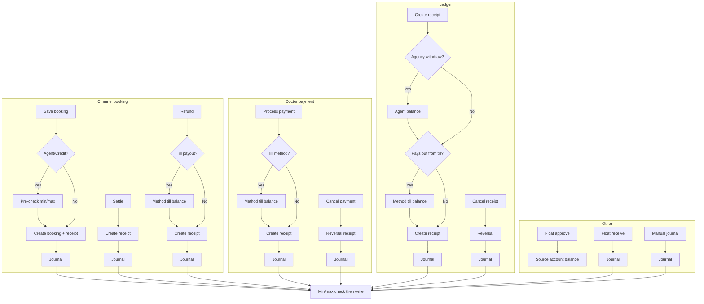

# Journal Entry Flows & Balance Checks

Where journal entries are created and how balance checks (till, agent, account min/max) apply in each flow.

---

## Quick reference: which checks run where

| Flow | Till (method-specific) | Agent / source | Account min/max |
|------|------------------------|----------------|------------------|
| **Save booking** | No (money in) | Agent soft limit + pre-check | Yes |
| **Settle** | No (money in) | — | Yes |
| **Refund** | Yes | — | Yes |
| **Doctor payment** | Yes | — | Yes |
| **Cancel doctor payment** | No (reversal) | — | Yes |
| **Ledger create** (branch expense / agency withdraw) | Yes | Yes (agency withdraw) | Yes |
| **Ledger cancel** | No (reversal) | — | Yes |
| **Float approve** | — | Source account | — |
| **Float receive** | — | — | Yes |
| **Manual journal** | — | — | Yes |

*Every journal write runs the account min/max check before creating the entry.*

---

## Flows

### Channel booking → Save booking (new booking)

1. Validate input.
2. If **agent/credit**: resolve accounts → soft credit limit check → **pre-check** (would posting break min/max?).
3. Create **booking**.
4. Create **receipt**.
5. Create **journal** (min/max checked again; then write).

*No till balance check — we are receiving into the till.*

---

### Channel booking → Settle (pay for existing booking)

1. Validate / resolve accounts.
2. Create **receipt**.
3. Create **journal** (min/max check → write).

*No till balance check — settlement adds to till.*

---

### Channel booking → Refund (full cancel or partial)

1. Load booking / validate (block if doctor already paid).
2. Resolve accounts.
3. If **paying out from till**: check till has enough for **that method** (cash / card / slip / cheque / e-wallet).
4. Create receipt + update booking.
5. Create **journal** (min/max check → write).

*Till check is method-specific: e.g. cash refund checks cash balance in till.*

---

### Doctor payment

1. Validate bookings / resolve accounts.
2. If **paying from till** (cash, card, slip, cheque, e-wallet): check till has enough for **that method**.
3. Create receipt + set bookings as doctor-paid.
4. Create **journal** (min/max check → write).

*Till check is method-specific.*

---

### Cancel doctor payment

1. Load original receipt / validate.
2. Create **reversal receipt**.
3. Create **journal** (min/max check → write).

*No till check — reversal puts money back in till.*

---

### Ledger → Create receipt (branch expense, agency withdraw, etc.)

1. Validate input.
2. If **agency withdraw**: check agent has enough balance.
3. Resolve accounts.
4. If **pays out from till** (branch expense or agency withdraw): check till has enough for **that method**.
5. Create **receipt**.
6. Create **journal** (min/max check → write).

*Till check is method-specific; agency withdraw also checks agent balance.*

---

### Ledger → Cancel receipt

1. Load original receipt / validate.
2. Create **reversal receipt**.
3. Create **journal** (min/max check → write).

*No till check — reversal.*

---

### Float request → Approve

1. Validate / load request.
2. Check **source account** (approver’s float) has enough balance.
3. Update request (approved, from/to accounts, receive code).

*Journal is created in the **receive** step when the cashier enters the code.*

---

### Float request → Receive (cashier enters code)

1. Validate receive code.
2. Create **journal** (transfer from bulk cashier account to cashier till; min/max check → write).

---

### Accounting → Manual journal entry

1. Validate input.
2. Create **journal** (min/max check for each account in lines → write).

*User chooses accounts and amounts; no till or agent checks.*

---

## Diagram

---

## Balance check types (reference)

- **Till (method-specific):** Before paying *out* from the till, we check the till’s balance for that method (cash, card, slip, cheque, e-wallet). Used in refund, doctor payment, ledger branch expense / agency withdraw.
- **Agent balance:** Before agency withdraw, we check the agent’s linked account has enough. For save booking (agent), we also check soft credit limit and then account min/max.
- **Source account:** Before float approval, we check the approver’s float account has enough to transfer.
- **Account min/max:** Every journal creation (standalone or in transaction) checks that no account would go below its minimum or above its maximum allowed balance; if any would, the journal is not written.
